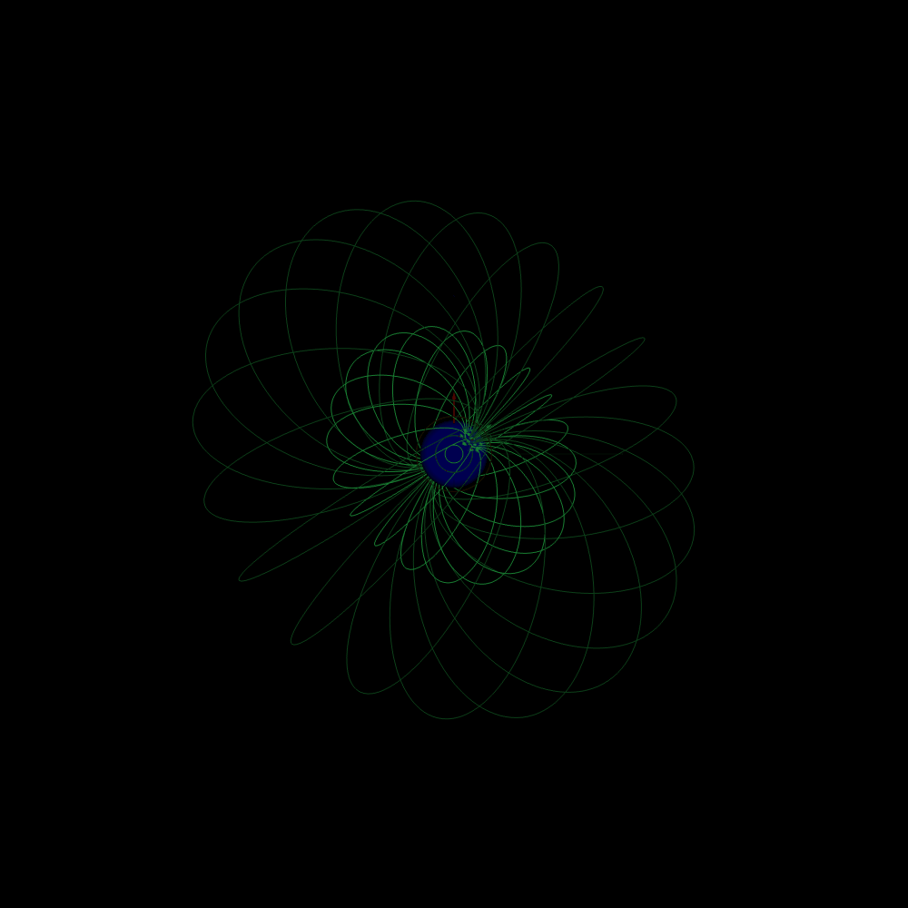
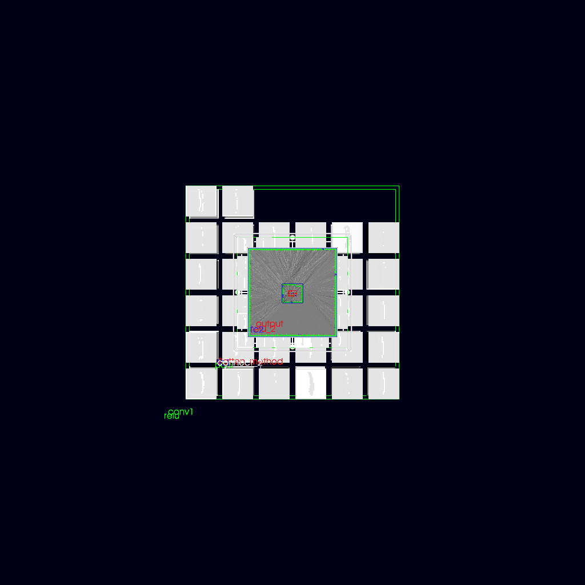
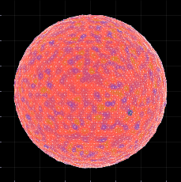

## 👋 Welcome to My Profile

Hi, I’m **Tanumoy Saha** — a **Physicist** trained in **Computer Vision**, working at the intersection of  
**Physics, Automation & Robotics, and Machine Learning**.

- 🔬 Interests: Physics · Automation & Robotics · Machine Learning  
- 🎓 Background: Physicist | Computer Vision  
- 🤝 Open to: Collaboration & opportunities in **device development**, **image processing**, and **ML**

### 📫 Reach Me
- 📧 Email: tanumoysaha5@gmail.com  
- 💼 LinkedIn: [Tanumoy Saha](https://www.linkedin.com)

## 🧰 Tech Stack

| Area | Tools |
|-----|------|
| 💻 **Programming** |   |
| 🤖 **Machine Learning & CV** |      |
| 🔬 **Scientific Computing** |    |
| 🦾 **CAD & Robotics** |  |
| 🎨 **Design & Illustration** |    |
| 📊 **Visualization & Tools** |       |

## 🚀 Projects Overview

**ML-PPA for Pulsar Signal Detection**  
Actively working on ML-PPA for pulsar signal detection using **Digital Twins** and **Machine Learning**,  
funded by **PUNCH4NFDI**, with **DZA Görlitz** and **HTW Berlin**.

<table>
  <tr>
    <td width="50%" style="vertical-align: top; text-align: center;">
      

        <h3 style="margin: 6px 0;">PulsarDT</h3>
        
DigitalTwin of Pulsar for synthetic pulse generation

        
      

      
    </td>
    <td width="50%" style="vertical-align: top; text-align: center;">
      

        <h3 style="margin: 6px 0;">PulsarSA</h3>
        
Pulsar signal analysis & feature extraction

        
      

      
    </td>
  </tr>
</table>

---

## 🛠️ Hobby & Open-Source Projects

### 🐕 Quadruped Robot – Mechanical Leg Design  

<table>
  <tr>
    <td width="54.2%" align="center">
      
    </td>
    <td width="54.2%" align="center">
       
       
      
    </td>
  </tr>
</table>

<h3>
  
  Torchrender3D — A Simple CNN Visualization Tool
</h3>

<table>
  <tr>
    <td width="50%" align="center">
      
    </td>
    <td width="50%" align="center">
      
    </td>
  </tr>
</table>

## 🎓 PhD Projects

Developed **digital twin models of cellular membranes**, focusing on **lipid self-organization driven by membrane curvature**.  
Additionally, designed and implemented **image-processing pipelines** to quantify **membrane dynamics** and **collective cell migration**.

**Publications:**
- 📄 *Physics of collective cell migration*  
  **Nature Physics (2019)** — https://www.nature.com/articles/s41567-019-0505-9
- 📄 *Curvature-driven lipid self-organization in cellular membranes*  
  **bioRxiv (2024)** — https://www.biorxiv.org/content/10.1101/2024.06.25.600357v1.abstract
- 📄 *Collective migration dynamics in cellular systems*  
  **Soft Matter, RSC (2023)** — https://pubs.rsc.org/en/content/articlelanding/2023/sm/d2sm01260j/unauth

<table>
  <tr>
    <td width="50%" align="center">
      
    </td>
    <td width="50%" align="center">
      
    </td>
  </tr>
  <tr>
    <td colspan="2" align="center">
      
    </td>
  </tr>
</table>

